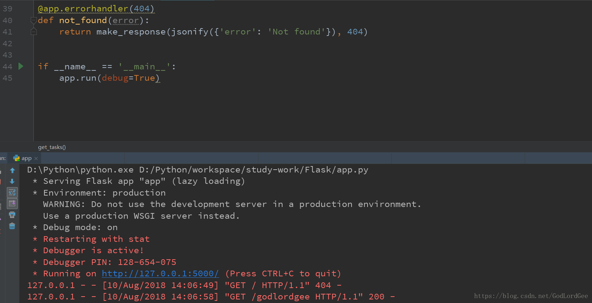

# Windows 下Flask Nginx Tornado 协同工作的简单例子

​                                                   2018年08月10日 15:52:12           [GodLordGee](https://me.csdn.net/GodLordGee)           阅读数：702                   

​                   

- #  

- # 前言

**之前用Python写了个相似度匹配的小程序，客户需要用.Net得到查询结果，但是问题在于.Net  4.0才支持调用Python程序的包，客户的.Net  是2.0的，无法调用写好的Python程序，解决方法想出了两个，一个是让客户升级到4.0（开什么玩笑！从2.0升级到4.0，他们的程序还跑得起来吗。。。（滑稽）），因此，就只有用另一个方法，通过.Net   调用网站的接口，然后网站返回需要的Json数据，用Flask、Nginx、Tornado实现了这个功能，网上资料十分不好找，也比较少，因为大多数是在Linux环境下配置的，因此，写下来，就权当做笔记了，  当然也希望能够帮到其他人，省去一些折腾的时间。**

- # 开发环境

**Python 3.6.5，Pycharm，Nginx 1.14.0，Tornado，Flask，一台有公网IP的服务器（能让客户远程调用接口，而不是本地访问调用）**

- # 参考文档

<http://blog.51cto.com/wenguonideshou/1982214>

- # 正文

**首先，我们要实现一个简单的Flask实例，达到显示一行文本的目的，这十分的简单，代码如下：**

```python
from flask import Flask, jsonify


from flask import make_response


 


 


app = Flask(__name__)


 


@app.route('/', methods=['GET'])#如果有人请求了，就返回godlordgee


def get_tasks():


    return 'GodLordGee'


 


 


@app.errorhandler(404)#如果没有对应的路径，就报错


def not_found(error):


    return make_response(jsonify({'error': 'Not found'}), 404)


 


 


if __name__ == '__main__':


    app.run(debug=True)


    #app.run(host='0.0.0.0',port=80)#可以指定ip，以及端口号
```

**就这样，我们就实现了一个简单的网页，效果如下：**



 **我们按照运行窗口给出的地址：http://127.0.0.1:5000/  在浏览器进行输入看看结果：**


 **可以看到正常的输出了，我们还可以设置网址的格式等等，这里不再赘述，Flask中文文档里面有很简单的例子，可以去看看。**

 

 

**接下来，我们要用Tornado 和Nginx达到远程访问的需要**

 

**首先，编写一个Tornado的简单程序**

```python
from tornado.ioloop import IOLoop


from tornado.wsgi import WSGIContainer


from tornado.httpserver import HTTPServer


from finish import app#这个是刚才我们写的Flask程序，把它导入进来


http_server=HTTPServer(WSGIContainer(app.app))#上面的Flask程序中，有一行是app=Flask(__name__)


#所以，第一个app是我们导入程序的名字，第二个app是我们的变量名，这里命名有点问题，注意一下


http_server.bind(5000,"0.0.0.0")#设置对外开启访问，端口设置为5000


http_server.start(1)


http_server.listen(9696)#也可以设置值进行本地访问，也就是监听本地的端口


IOLoop.instance().start()
```

**运行：**


**可以看到运行成功了，通过我们设置的9696端口，访问了Flask文件里面写好的GodLordGee字符**

**如果我们要投入到生产环境，那么一个可靠的服务器是十分重要的，因此，Nginx就是接下来我们需要的东西了**

 

**首先，在官网下载Nginx，推荐下载稳定版，毕竟，稳定嘛，哈哈**

 

**下载完以后，在C盘根目录创建一个nginx的文件夹，然后把所有的文件解压到这个文件夹里面去**

 

**这时候需要说到一个小问题，你解压完以后，看到有个EXE的文件：**


**很多人的第一反应是双击打开我没有说错吧，但是你会发现窗口一闪而过，然后，你就会多点几下，想要让他显示出来，这时候，你打开任务管理器，就会看到：**


**这里说一条命令，批量杀死进程的命令，就是**

```
taskkill   /fi   "imagename  eq   nginx"  /f
```

**这样，就可以把所有的Nginx杀死。**

 

**接下来，我们对Nginx进行配置，打开Nginx文件夹，进入conf文件夹，然后打开nginx.conf**

**里面东西很多，我们只用动一部分：**

```
server {


        listen       80;#端口


        server_name  47.106.207.138;#公网的ip地址，也可以是你没有加www的网址


 


        #charset koi8-r;


 


        #access_log  logs/host.access.log  main;


 


        #location /test {


        #    root   C:\python\workspace;


        #    index  test.html;


        #}


 


        #error_page  404              /404.html;


 


        # redirect server error pages to the static page /50x.html


        #


        error_page   500 502 503 504  /50x.html;


        location = /50x.html {


            root   html;


        }


 


        # proxy the PHP scripts to Apache listening on 127.0.0.1:80


        #


        location / {


            proxy_pass   http://localhost:5000;#所有访问80端口的，都会转到5000端口


        }
```

 

**这样保存以后，就大功告成了！先运行我们之前的Tornado 程序（可以在CMD里面用python tornado.py），然后在cmd运行 Nginx（start Nginx）,（如果想要看看Nginx的其他一些命令，可以看我另一篇文章：nginx的相关命令）那么就成功了！如图：**

 


 

**可以看到，我们直接输入地址，不需要输入端口号，就可以自己跳转到指定的网页。（如果无法跳转，可能是服务器的安全组没有配置，例如我的是阿里云的，所以在阿里云里面进行安全组配置）**

**这就是最简单的Flask + Tornado + Nginx 的实例了，如果想要让这个实例发挥一定的作用，只需要在编写Flask 程序的时候，调用各种你写的函数，然后return就行了，可以return json格式，也可以是html等等**

 

**最后，还有个需要注意的问题，就是运行Tornado程序的时候，可能会报套接字的错误：**OSError: [WinError 10048] 通常每个套接字地址(协议/网络地址/端口)只允许使用一次

**遇到这个问题，就是你指定的端口被占用了，你可以看看你之前调试程序的时候是不是有一些程序没有关闭，造成端口占用，还可以更改端口**

 

**最后，祝大家在编程的路上，披荆斩棘，成功秃顶哈哈哈哈哈哈哈哈哈哈哈哈**