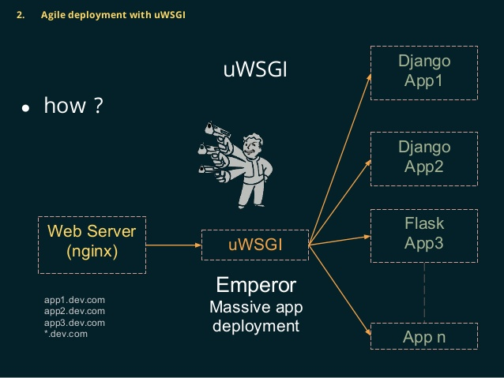

#  					从django、flask、tornado的部署说起 				

 						2018.03.30 10:29 						13838浏览 					

 																					 							 						

今天我们来讨论一下、django、flask和tornado的部署对比：

### 1. 概述

在python的web开发框架中，目前使用量最高的几个是django、flask和tornado， 经常会有人拿这几个对比，相信大家的初步印象应该是 django大而全、flask小而精、tornado性能高。

tornado性能比django和flask高很多是因为tornado在底层io处理机制上和django以及flask有着根本的区别：

```
1. tornado、gevent、asyncio、aiohttp：底层使用的是事件循环+协程
2. django和flask： 传统的模型，阻塞io模型
```

虽然django和flask比tornado和asyncio性能低，但是他们作为老牌的框架：生态丰富，代码容易理解，简单啊！但是我相信通过asyncio和tornado进行并发编程必定会成为未来的另一个主流方向。这里我个人更看好基于asyncio的框架。nodejs和go语言都得益于协程轻松实现了高并发。

但是今天我们要介绍的并不是协程，而是从这些框架的部署来进行对比：

### 2. django和flask

在django和flask部署中，我们经常会遇到以下几个概念:

```
web框架、 wsgi、  uwsgi、   uWSGI、    nginx
```

这些概念是什么意思:

1. WSGI：全称是Web Server Gateway  Interface，WSGI不是服务器，python模块，框架，API或者任何软件，只是一种规范，描述web server如何与web  application通信的规范。要实现WSGI协议，必须同时实现web server和web  application，当前运行在WSGI协议之上的web框架有Bottle, Flask, Django。
2. uwsgi：与WSGI一样是一种通信协议，是uWSGI服务器的独占协议，用于定义传输信息的类型(type of information)
3. uWSGI：是一个web服务器，实现了WSGI协议、uwsgi协议、http协议等。
4. WSGI协议主要包括server和application两部分：
5. WSGI server负责从客户端接收请求，将request转发给application，将application返回的response返回给客户端；
6. WSGI  application接收由server转发的request，处理请求，并将处理结果返回给server。application中可以包括多个栈式的中间件(middlewares)，这些中间件需要同时实现server与application，因此可以在WSGI服务器与WSGI应用之间起调节作用：对服务器来说，中间件扮演应用程序，对应用程序来说，中间件扮演服务器。
7. WSGI协议其实是定义了一种server与application解耦的规范，即可以有多个实现WSGI  server的服务器，也可以有多个实现WSGI  application的框架，那么就可以选择任意的server和application组合实现自己的web应用。例如uWSGI和Gunicorn都是实现了WSGI  server协议的服务器，Django，Flask是实现了WSGI application协议的web框架，可以根据项目实际情况搭配使用。



像Django，Flask框架都有自己实现的简单的WSGI server，一般用于服务器调试，生产环境下建议用其他WSGI server。比如django启动 [manage.py](http://manage.py) runserver 就是启动的这个，这种只适用于本地开发的时候使用，线上运行还是需要配置nginx+uwsgi+django才行。

wsgi 除了解析 http 协议以及 http  端口侦听外，还负责了流量转发以及 wsgi application 进程管理的功能。一般 wsgi 框架内置的 wsgi server  都是一个单进程，一次只能处理一个请求。而目的通用的 wsgi server(gunicorn, uwsgi)都至少支持 pre fork  模型，这种模型会起一个 master 来侦听请求，并启动多个 slave(每个 slave 是一个 wsgi application)，  master 负责把请求转发到空闲的 slave 上。除了这种传统的基于进程的 pre fork 同步模型，不同的 wsgi server  也会支持一些其它模型，有基于线程的同步模型，也有基于 asyncio 的异步模型。

### 3. nginx又有什么用呢？

- Ningx是一个反向代理服务器

  什么是反向代理？

  正向代理，例如FQ用的代理服务器就是正向代理，浏览器主动请求代理服务器，代理服务器转发请求到对应的目标服务器
   反向代理，部署在Web服务器上，代理所有外部网络对内部网络的访问。浏览器访问服务器，必须经过这个代理，是被动的。
   正向代理的主动方是客户端，反向代理的主动方是Web服务器。


- 主要是因为 wsgi server 支持的并发量比较低，一般会用一个专门的 http server 来做一层缓冲，避免并发量过大时直接服务挂掉。

  反向代理的作用：
   \1.  安全，客户端对Web服务器的访问需要先经过反向代理服务器。这样可以防止外部程序对Web服务器的直接攻击。
   \2.  负载均衡，反向代理服务器可以根据Web服务器的负载情况，动态地把HTTP请求交给不同的Web服务器来处理，前提是要有多个Web服务器。
   \3.   提升Web服务器的IO性能。一个HTTP请求的数据，从客户端传输给服务器，是需要时间的，例如N秒，如果直接传给Web服务器，Web服务器就需要让一个进程阻塞N秒，来接收IO，这样会降低Web服务器的性能。如果使用反向代理服务器，先让反向代理服务器接收完整个HTTP请求，再把请求发给Web服务器，就能提升Web服务器的性能。还有一些静态文件的请求，可以直接交给反向代理来处理，不需要经过Web服务器。
   Nginx是一个高性能的HTTP和反向代理服务器。

### 4. Nginx+uWSGI+应用程序的架构


### 5. django如何编写异步代码呢？

```
1. 直接用传统的异步编程(进程，线程，协程)，虽然有些 wsgi server 支持 asynio 模型，但是这也需要用户所写的代码做相应的支持。这就导致了如果我们在 wsgi application 的时候不能随便使用线程和异步 IO ，如果用了就需要配置 wsgi server 使其支持我们自己的写法。因此为了使得我们缩写的 application 能部署在任意的 wsgi server(container)中，我们就只能写同步代码了。
2. 使用分布式异步编程，使用类似 celery 的方式，将需要异步处理的东西发送到 worker 去处理。
```

python 传统的这种 wsgi  模型，主要是为了方便框架开发者只需要专注框架层面，而非 http 处理层面。但这样却增加了服务部署的复杂度，需要同时部署和配置 http  server 和 wsgi server ，如果想支持异步还要部署 worker ，而使用 tornado 或 go  开发的应用因为自己实现了高效 http 处理的应用只需要部署自己就可以了。

### 6. asyncio VS tornado

asyncio作为python的原始协程库，也是python最具野心和将来会重点打造的模块，asyncio提供了更多的基础功能，tornado是web服务器和web框架，两者原理是一样的，都有很不错的发展。

- twisted 这种模型：

这种模型和上面的传统模型处于一个时期，这种模型和 nodejs  差不多，都是基于回调的模型，适用于高 IO 低 CPU 的场景。这种模型自己实现了一个基于回调 http server(event  loop)，每一个请求都被注册成一个异步函数来处理，然后主循环来不断的循环这些函数。这样就和 pre fork 模型有了区别， pre fork  模型中每一个 slave 都是一个 wsgi application ，一个 wsgi application  都只能处理一个请求，而回调模型只有一个线程，不仅极大的减少了内存的分配还减小了进城以及线程间的切换开销，从而可以支持高 IO  并发。但是这种模型也有很明显的缺点，就是一旦应用程序有大量的 CPU  计算，就会让这个线程堵住，所有的请求都会收到影响，如果应用在处理一个请求时崩溃，所有的请求也都会收到影响。

- asyncio、tornado、gevent 这种模型：

  因为回调的写法不易读也容易出错，于是将回调的写法改成了同步的写法。这种模型和 koa2 和 go net/http 查不多，  asyncio 提供了类似 go coroutine 的功能和写法，而 aiohttp 则提供了类似 go 中的 net/http 的 http  处理库。

想要彻底理解tornado这种模式以及想要自己去实现高并发的web服务器我们需要理解协程，协程理解比线程和进程难不少，最复杂的调度机制，通过asyncio去理解会相对容易


 																		[Django](https://www.imooc.com/article/tag/124) 											

本文原创发布于慕课网 ，转载请注明出处，谢谢合作

 										

*44*人点赞

*10* 评论

 							 							评论 							 						

共同学习，写下你的评论

[10楼](https://www.imooc.com/u/4299479/articles)

日久弥新


老师python3.7+Django2.1中xadmin部署后报错TypeError: login() got an unexpected keyword argument 'extra_context'，老师清楚是什么原因么，找了好久


*0*回复 2019.03.05

[9楼](https://www.imooc.com/u/231644/articles)

Spotlight


booby老师你好，我想对学校的OJ进行重写（原来是基于ssm开发的，并发很差，300左右就gg）,请问是使用Flask好呢还是tornado好？


*0*回复 2018.12.14

[](https://www.imooc.com/u/2255006/articles)

bobby

 回复 

Spotlight

如果对并发有要求 可以优先考虑使用tornado， 但是tornado需要你自己完成的功能就比较多了，对技术的要求相对也比较高。

回复 2018-12-16

[](https://www.imooc.com/u/231644/articles)

Spotlight

 回复 

bobby

好的 谢谢老师，tornado的话准备看您的Tornado课程（现在还没有更完）希望有所收获！

回复 2018-12-17

[](https://www.imooc.com/u/2255006/articles)

bobby

 回复 

Spotlight

感谢支持，课程已经录制完成，慕课网正在持续更新中

回复 2018-12-17

[8楼](https://www.imooc.com/u/6129874/articles)

东泽XD


文中提到的pre fork模型及回调模型指的是不是IO多路复用？


*0*回复 2018.11.02

[](https://www.imooc.com/u/2255006/articles)

bobby

 回复 

东泽XD

pre fork模型不是使用的io多路复用， 采用的是多进程+多线程模式

回复 2018-11-03

[7楼](https://www.imooc.com/u/6129874/articles)

东泽XD


希望老师多写一点这方面的内容或者科普，另外出一些相关课程也会支持的！


*0*回复 2018.11.02

[](https://www.imooc.com/u/2255006/articles)

bobby

 回复 

东泽XD

近期已经上线了 tornado从入门到进阶的实战课程，谢谢支持

回复 2018-11-03

展开查看剩余评论