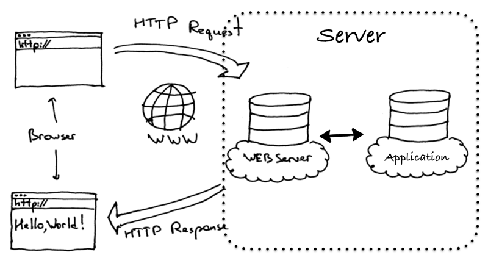

#  					基于Python的web架构之Tornado+Flask 				

 						2018.12.06 08:33 						3937浏览 					

 																					 							 						

## 1、Web框架介绍

浏览器上网的过程简单来说就是客户端和服务器的交互过程，在物理服务器上运行着服务器程序，永久地等待客户端（主要是浏览器，比如Chrome，Firefox等）发送请求。通常服务器程序包含了   Web服务器和Web应用两部分，Web服务器接收客户端的请求后，由Web应用对浏览器的请求进行处理，将生成的响应传递给Web服务器，再由Web服务器返回给客户端。
 为了简化Web应用的开发，使开发者可以专注于编写业务逻辑代码而无需关心Web应用内各模块连接之类的重复性工作，继而在Web应用上产生了Web框架。一般Web框架的架构如下图所示，基于Python的Web框架如Django、tornado、flask、webpy等都在这个范围内进行不同的调整。如何在建立的Web服务器上运行一个Django应用或Flask应用，而无需对这些web框架或Web服务器做任何改变？WSGI协议可将web框架和web服务器分开，开发者可选择适合自己的配对，混合匹配web框架和web服务器，对于服务器和框架开发者提供便利使他们可以专注于自己偏爱的领域和专长而不至于相互牵制。

这里我们把WSGI、uwsgi、uWSGI这几个概念整理下：
 WSGI（Web Server Gateway Interface）是为Python定义的Web服务器和Web应用程序或框架之间的一种简单而通用的接口协议，主要包括服务器和应用程序两部分，是描述了web服务器如何与web应用程序通信的规范。
 uwsgi基于二进制的线路协议，与WSGI通信协议作用相同，属于uWSGI服务器的独占协议，用于定义传输信息的类型(type of information)。
 uWSGI是一个web服务器，实现了WSGI协议、uwsgi协议、http协议等。

## 2、Django、Tornado和Flask框架对比

在Python的web开发框架中，目前使用量最高的有Django、Flask和Tornado， 经常会有人拿这几个对比，相信大家的初步印象应该是 Django大而全、Flask小而精、Tornado性能高。
 Django是Python 中最全能的 web  开发框架，走大而全的方向。它最出名的是其全自动化的管理后台：只需要使用起ORM，做简单的对象定义，它就能自动生成数据库结构、以及全功能的管理后台。不过Django提供的方便，也意味着Django内置的ORM跟框架内的其他模块耦合程度高，深度绑定了该框架，应用程序必须使用Django内置的ORM，否则就不能享受到框架内提供的种种基于其ORM的优秀特性。
 Tornado全称Tornado Web  Server，是一个用Python语言写成的Web服务器兼Web应用框架。Tornado走的是少而精的方向，注重的是性能优越，它最出名的是异步非阻塞的服务器方式。(Tornado框架和服务器一起组成一个WSGI的全栈替代品。单独在WSGI容器中使用tornado  web框架或者tornaod  http服务器，有一定的局限性，为了最大化的利用tornado的性能，推荐同时使用tornaod的web框架和HTTP服务器。)
 Flask是一个使用 Python 编写的轻量级 Web 应用框架，也被称为  “microframework”，语法简单，部署很方便，整个框架自带了路径映射、模板引擎（Jinja2）、简单的数据库访问等web框架组件，支持WSGI协议（采用  Werkzeug）。Flask使用 BSD 授权。 Flask使用简单的核心，用 extension  增加其他功能，虽然没有默认使用的数据库、窗体验证工具，然而Flask保留了扩增的弹性，可以用Flask-extension加入ORM、窗体验证工具、文件上传、各种开放式身份验证技术这些功能。
 从性能上看Tornado 比Django、Flask等主流 Web 服务器框架相比有着明显的区别：它是非阻塞式服务器，速度相当快。然而  Tornado 相比 Django  和Flask属于较为原始的框架，插件少，许多内容需要自己去处理。而Flask插件多，文档非常专业，有专门的公司团队维护，对于快速开发很有效率。由于WSGI协议的存在，可以结合  Tornado  的服务器异步特性、并发处理能力和Flask的文档和扩展能力为一体。虽然像Django，Flask框架都有自己实现的简单的WSGI服务器，但一般用于服务器调试，生产环境下建议用其他WSGI服务器，比如Nginx+uwsgi+Django方式。

Tornado关于使用平台的说明：
 Tornado should run on any Unix-like platform, although for the best  performance and scalability only Linux (with epoll) and BSD (with  kqueue) are recommended for production deployment (even though Mac OS X  is derived from BSD and supports kqueue, its networking performance is  generally poor so it is recommended only for development use). Tornado  will also run on Windows, although this configuration is not officially  supported and is recommended only for development use.
 Tornado应该运行在类Unix平台，在线上部署时为了最佳的性能和扩展性，仅推荐Linux和BSD（因为充分利用Linux的epoll工具和BSD的kqueue工具，是Tornado不依靠多进程/多线程而达到高性能的原因）。对于Mac  OS  X，虽然也是衍生自BSD并且支持kqueue，但是其网络性能通常不太给力，因此仅推荐用于开发。对于Windows，Tornado官方没有提供配置支持，但是也可以运行起来，不过仅推荐在开发中使用。

## 3、Tornado+ Flask实现方式

（1）首先，我们导入了 Flask 类，这个类的实例将会是我们的 WSGI 应用程序。

```
from flask import Flask
```

（2）接下来，我们创建一个该类的实例app，第一个参数是应用模块或者包的名称。 如果使用单一的模块（如本例），应该使用 **name** ，因为模块的名称将会因其作为单独应用启动还是作为模块导入而有不同（ 也即是 ‘**main**’ 或实际的导入名）。这是必须的，这样 Flask 才知道到哪去找模板、静态文件等等。

```
app = Flask(__name__)
```

（3）然后，我们使用route()装饰器把一个函数绑定到对应的URL上，告诉 Flask什么样的URL能触发我们的函数。 这个函数的名字也在生成URL时被特定的函数采用，这个函数返回我们想要显示在用户浏览器中的信息。

```
@app.route('/', methods=['GET'])
def index(name = None):
    if request.method == 'GET':
        name = "WEB SERVER"
        return render_template('index.html',name=name)
```

（4）最后我们用 run() 函数来让应用运行在本地服务器上。  if **name** == ‘**main**’: 确保服务器只会在该脚本被 Python 解释器直接执行的时候才会运行，而不是作为模块导入的时候。

```
if __name__ == '__main__':
    try:
        app.run(host='0.0.0.0', port=80, debug=False)
    except:
        pass
```

（5）外部可访问的服务器。如果你运行了这个服务器（app.run()），你会发现它只能从你自己的计算机上访问，网络中其它任何的地方都不能访问。在调试模式下，用户可以在你的计算机上执行任意  Python 代码。因此，这个行为是默认的。如果你禁用了 debug 或信任你所在网络的用户，你可以简单修改调用 run()  的方法使你的服务器公开可用，如下:app.run(host=‘0.0.0.0’)这会让操作系统监听所有公网 IP。
 （6）虽然 run() 方法适用于启动本地的开发服务器，但是你每次修改代码后都要手动重启它。这样并不够优雅，而且 Flask  可以做到更好。如果你启用了调试支持，服务器会在代码修改后自动重新载入，并在发生错误时提供一个相当有用的调试器。有两种途径来启用调试模式。一种是直接在应用对象上设置:

```
app.debug = True
app.run()
```

另一种是作为 run 方法的一个参数传入:

```
app.run(debug=True)
```

两种方法的效果完全相同。

（1）用Python 生成 HTML  十分无趣，而且相当繁琐，因为你必须手动对 HTML 做转义来保证应用的安全。为此，Flask 配备了 Jinja2 模板引擎。你可以使用  render_template()  方法来渲染模板。你需要做的一切就是将模板名和你想作为关键字的参数传入模板的变量。这里有一个展示如何渲染模板的简例:

```
from flask import render_template

@app.route('/hello/')
@app.route('/hello/<name>')
def hello(name=None):
    return render_template('hello.html', name=name)
```

Flask 会在 templates 文件夹里寻找模板。所以，如果你的应用是个模块，这个文件夹应该与模块同级；如果它是一个包，那么这个文件夹作为包的子目录:
 情况 1: 模块:
 /application.py
 /templates
 /hello.html
 情况 2: 包:
 /application
 /**init**.py
 /templates
 /hello.html

在Tornado中,我们可以通过wsgi模块下的WSGIContainer类运行其他WSGI应用的,例如Flask、Bottle、Django应用。
 （1）创建了一个HTTP服务器实例http_server，因为服务器要服务于我们刚刚建立的web应用，将接收到的客户端请求通过web应用中的路由映射表引导到对应的handler中，所以在构建http_server对象的时候需要传入web应用对象app。可以使用自身的web框架，  如果使用托管的应用，将要托管的应用以参数的形式传入到WSGIContainer类中。

```
    http_server = HTTPServer(WSGIContainer(app))
```

（2）紧接着,我们定义这个服务器监听的端口，将服务器绑定到80端口。

```
    http_server.listen(80)
```

（3）IOLoop 是 Tornado  的核心I/O循环调度模块，也是tornado高性能的基石，封装了Linux的epoll和BSD的kqueue，用于处理 socket  相关的连接、响应、异步读写等网络事件。每个 Tornado 进程都会初始化一个全局唯一的 IOLoop 实例，在 IOLoop 中通过静态方法  instance() 进行封装，获取 IOLoop 实例直接调用此方法即可启动 IOLoop 实例，即启动事件循环机制，配合非阻塞的 HTTP  Server 工作。
 如果是tornado.ioloop.IOLoop.current().start()语句，IOLoop.current()返回当前线程的IOLoop实例。IOLoop.start()启动IOLoop实例的I/O循环，同时服务器监听被打开。

```
    IOLoop.instance().start()
```

（4）运行python [webServer.py](http://webServer.py)。